# Homelab

Queremos instalar en un servidor Proxmox de virtualización un laboratorio para aprender a gestionar y detectar incidentes.

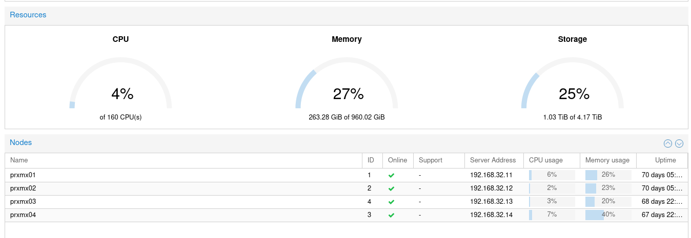

Nuestro sistema debe tener:

* Un router/cortafuegos con:
    * pfBlocker (para limitar acceso por dominios y lista de IP)
    * Snort (como IPS)
* Un servidor Ubuntu con los siguientes servicios:
    * InfluxDB
    * Grafana
    * Kibana
    * Elastic
* Una máquina [Windows Flare](https://github.com/mandiant/flare-vm)
* Un servidor Windows Server 2012
* Un kali Linux Purple
* Un kali Linux Estandar


## Instalación pfSense

Necesitamos una máquina virtual con 2 tarjetas de red (o una tarjeta si disponemos de switch inteligentes con soporte VLAN).

1) Descarga de la ISO
   1) Desde su Web y luego se sube a Proxmox
   2) Descargar por URL desde Proxmox
   3) Como ya la tengo la subo por `sftp` `/var/lib/vz/template/iso`
2) Creamos una VM con 4 GB de RAM, 20 GB de disco y 4 núcleos. Configuramos para que arranque con la USO
3) Ponemos una tarjeta de red que va al bridge donde está la interfaz física (vmrb0 por ejemmplo)
4) Ponemos una segunda tarjeta de red a un switch virtual (OVS Bridge)

## Configuración de pfSense

En modo terminal configuramos qué boca será la WAN, qué boca la LAN, la IP de cada uno, el servicio DHCP en la LAN y habilitamos la interfaz Web.

Vía Web, configuramos la contraseña de admin (por defecto **pfsense**), los DNS, puerta de enlace, servicio de DNS, servidores DNS para el servicio DNS.

A continuación instalamos los paquetes:

* **openvpn-client-export:** Permite crear redes privadas virutales (VPN) para establecer conexiones seguras.
* **snort:** Es el conocido IDS (sistema de detección de instrucciones)/IPS (sistema de prevención de instrucciones). Estamos hablando de IPS cuando activamos el bloqueo de IPs que ofenden reglas.
* **pfBlockerNG:** Bloqueador de contenido en base a dominios y direcciones IP. Cargamos listas negras de Internet y así bloqueamos contenido como: pornografía, páginas de apuestas y juegos, de contenido ofensivo, etc.
* **darkstat:** Genera estadísticas por dirección IP, MAC, protocolos y puertos.
* **ntopng (puerto 3000):** Monitor de red (se pueden ver flujos y hacer capturas en tiempo real).

### OpenVPN

1. Creamos un nuevo certificado y lo añadimos
2. Configuramos el nombre del servidor VPN, el Endpoint, los ajustes del tunel y del cliente
3. Habilitamos las reglas de tráfico

    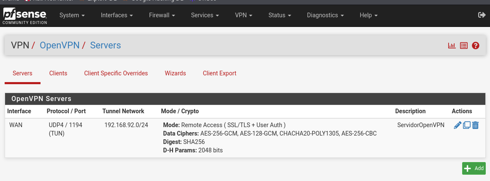

4. Creamos un certificado de usuario

    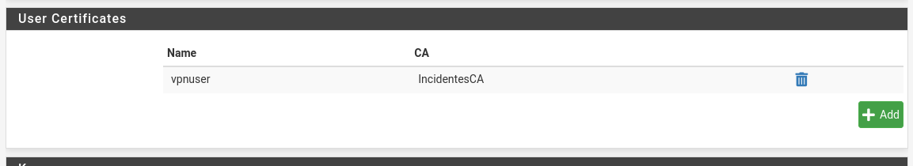

5. Exportamos la configuración de la VPN
6. Importamos la configuración VPN, editamos el perfil lponiendole un usuario y una contraseña y activamos la VPN

    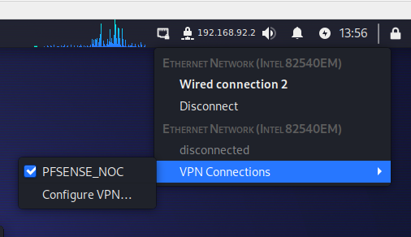

### Configuración de Snort

1. Nos registramos en la página de snort para obtener el **Oinkmaster Code** y ponerlo en nuestro Snort
2. Habilitamos las reglas, ponemos que las reglas se actualizen cada 12 horas y que el host que se bloquee dure 30min

    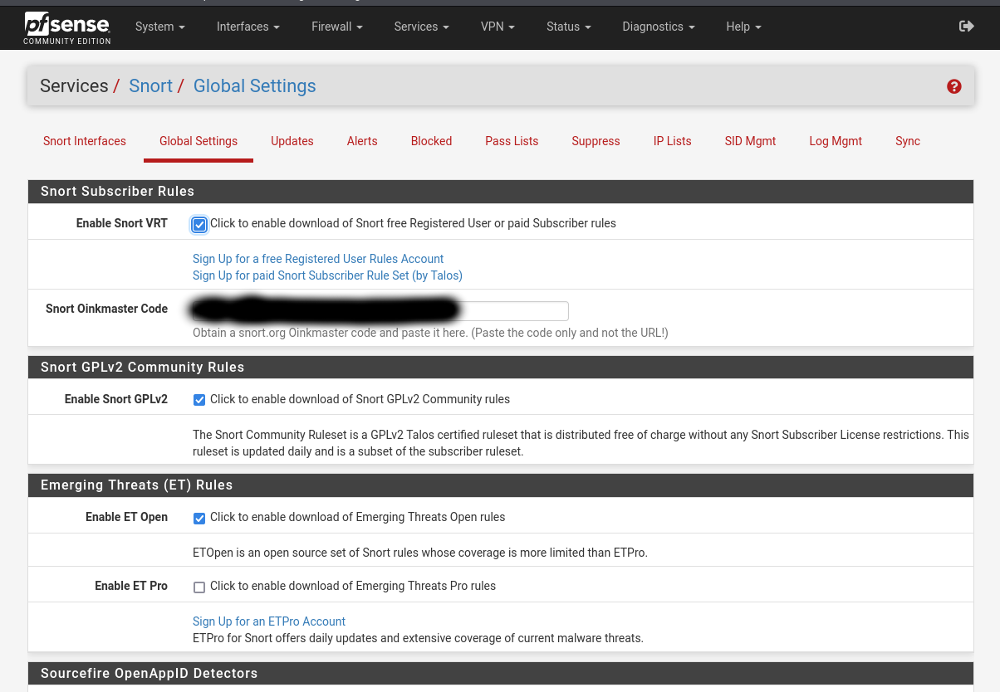

3. Podemos configurar una lista negra de ip que generará alertas por cada paquete enviado o dirigido a una dirección IP incluida en dichas listas negras.

    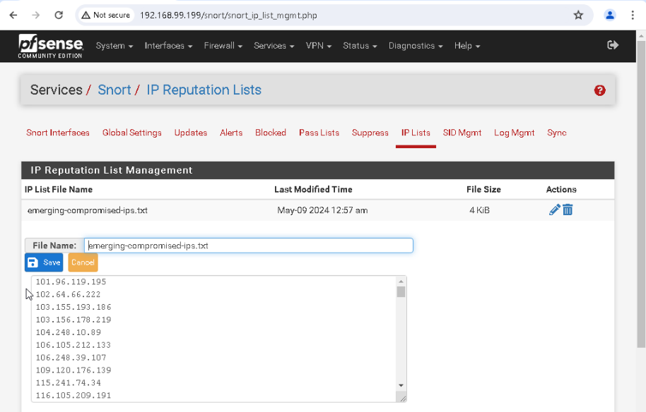

4. También podemos crear nuestras propias reglas de snort para personalizarlas como queramos, por ejemplo que nos alerte en caso de un intento de comunicación ssh, también pdemos coger reglas personalizadas de moqhao

    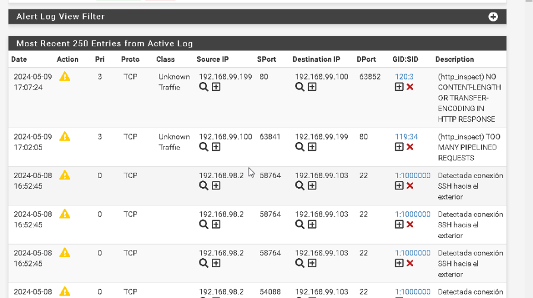

    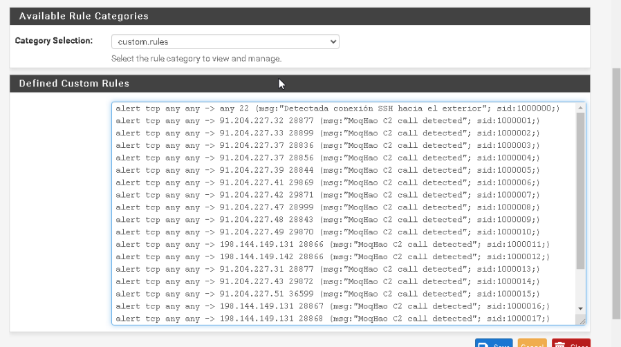

### pfBlockerNG

Descargamos el paquete pfBlockerNG

1. En DNSBL activamos el módulo Python que es más eficiente con listas muy grandes
2. En DNSBL Groups creamos un nuevo grupo y añadimos [la lista copiando una de Internet](https://raw.githubusercontent.com/hagezi/dns-blocklists/main/domains/multi.txt)
3. También podemos añadir listas en Feeds, le damos al +, los ponemos en ON y Deny Both

    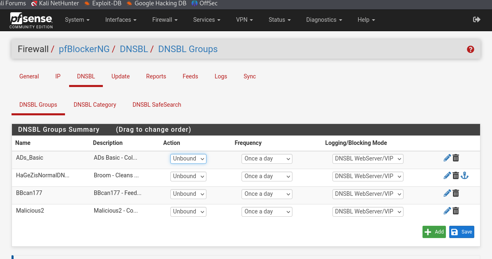

4. En DNSBL Category activamos los filtros de AD, Pornografía, Spyware y Trackers de Shallalist

    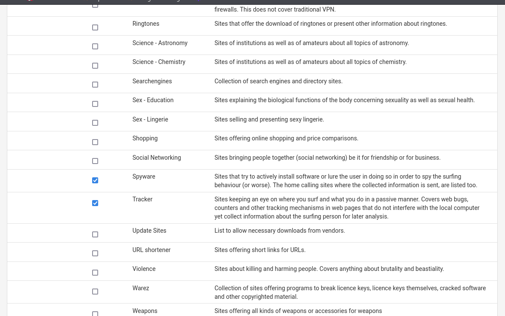

5. Habilitamos listas de PR1, PR14 Y PR5. Así con DNSBL. Firewall > pfBlockerNG > Feeds

    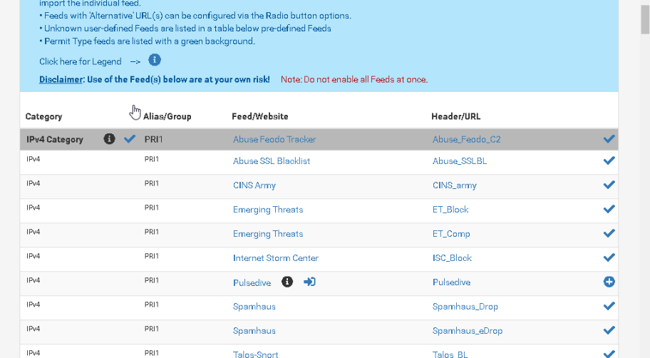

### Darkstat
Descargamos el paquete "darkstat"

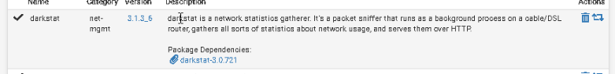

#### Nos dirigimos a Services > darkstat

Para configurar Darkstat elegiremos las interfaces que queremos capturar además del puerto en el que lo consultaremos que por defecto es 666

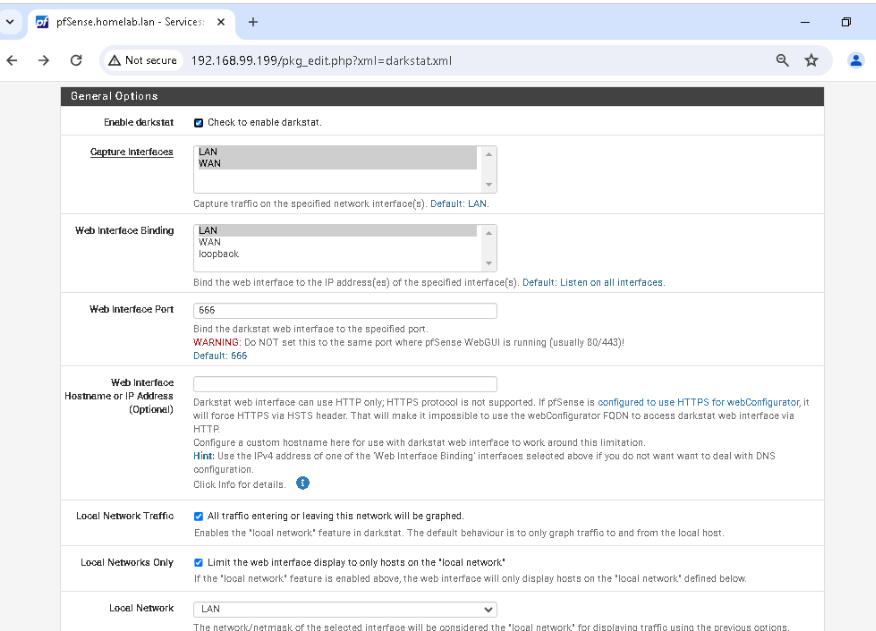

#### Consultamos la ip de nuestro pfsense en el puerto indicado (666) y podemos ver el tráfico

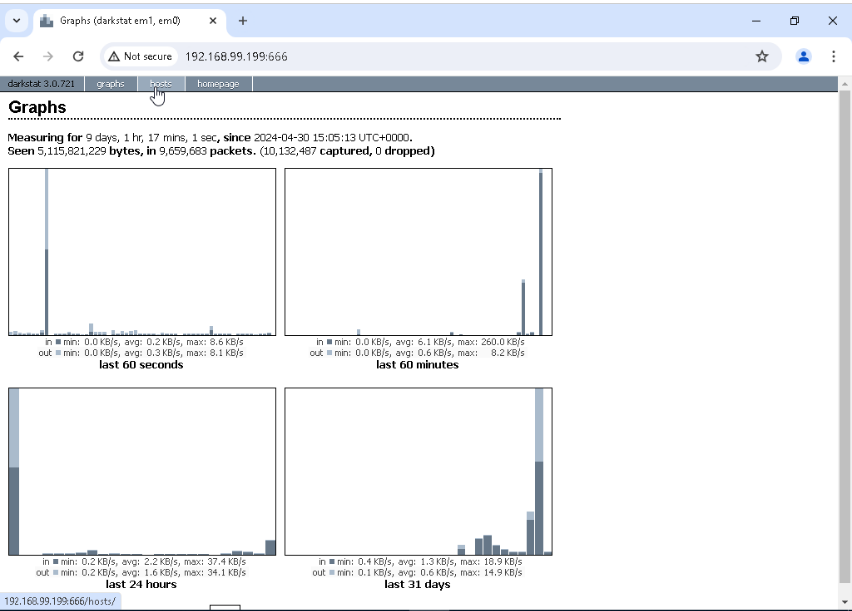


### NtopNG

Descargamos el paquete "ntopng"

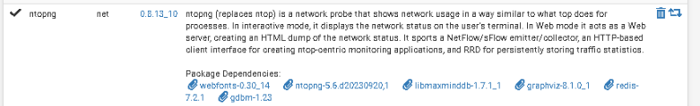

#### Nos dirigimos a Diagnostics > ntopng Settings

Aqui podremos configurar lo necesario para poder usar ntopng, como activarlo, configurar una contraseña, interfaces y demás.


Accedemos a NTOP y podemos consultar los flujos al acceder al cualquier página como por ejemplo marca, vemos la cantidad de informacion y fuentes que cargan.

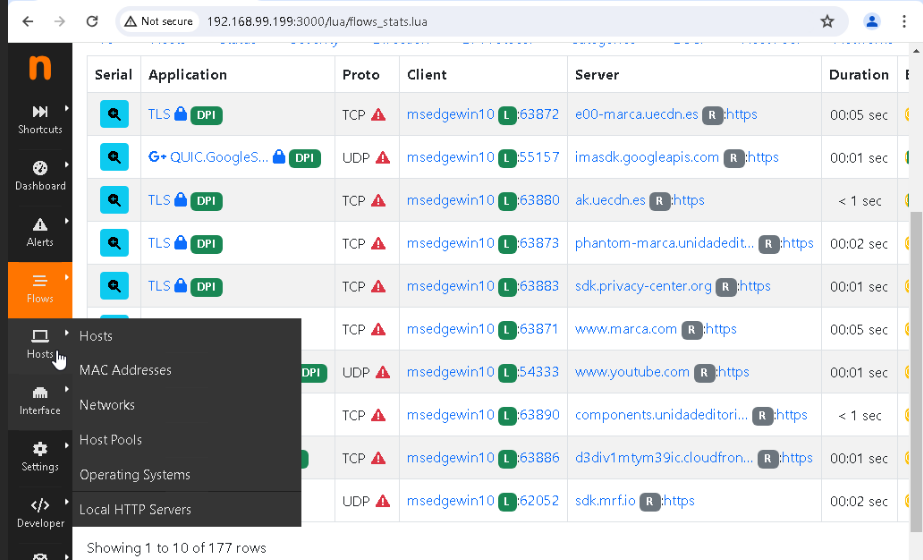


## Como usar un OVA en Proxmox

Para usar un OVA en Proxmox, por SSH subimos el archivo al servidor. Vamos a suponer que tenemos [un OVA de Windows 10](https://archive.org/details/msedge.win10.virtualbox). <!-- si no tenemos el OVA lo buscamos en archive.org -->

Desempaquetamos el OVA con tar:

```bash
tar -xf archivo.ova
```

Buscamos el archivo VMDK, que será el disco de Windows 10.

Creamos una máquina virtual para Windows 10. No le ponemos ni CDROM ni disco duro. Sólo 12 GB de RAM, 6 cores y BIOS normal. Una vez creada buscamos el número o el ID de la máquina virtual y con él, desde línea de comandos en Proxmox hacemos:

```bash
qm disk import 101 'MSEdge - Win10-disk001.vmdk'
```

Esto importa el disco `MSEdge - Win10-disk001.vmdk` en la máquina 101, lo guarda en el espacio de almacenamiento local-lvm (en esa partición). Una vez acaba el proceso el disco aparece en la máquina pero sin conectar. Hacemos doble click y lo añadimos como SATA 0.

La máquina viene con 40 GB , es poco, necesitamos darle otros 30 GB. Pulsamos en hardware -> disk action -> resize.

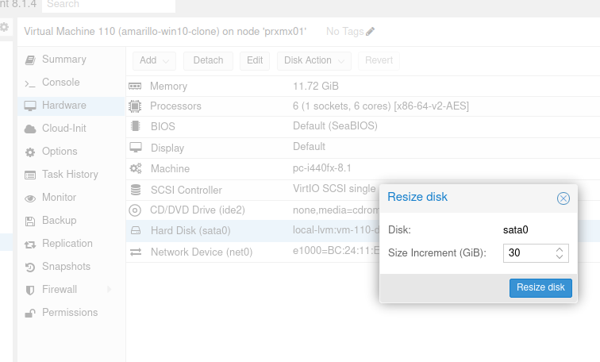

En Windows, nos vamos al administrador de discos y extendemos la partición hasta el final del disco:

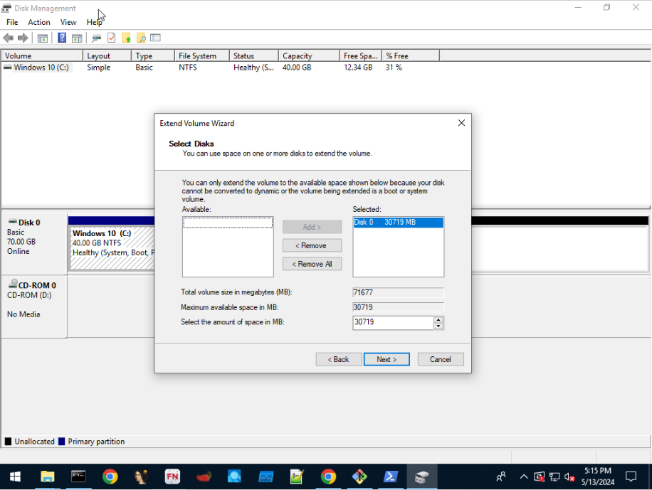

## Instalación Mandiant FLARE-VM

Deshabilitamos Windows Update y Windows Defender hasta que lo instalemos.
  * Deshabilitamos Windows Defender desde [`Edit group policy`](https://www.nosolohacking.info/como-desactivar-windows-defender-via-gpo/)
  * Deshabilitamos Windows Update desde [`Edit group policy`](https://www.windowscentral.com/how-stop-updates-installing-automatically-windows-10)

Abrimos una `PowerShell` prompt como administrador.

Descargamos el script de la instalación:

```bash
(New-Object net.webclient).DownloadFile('https://raw.githubusercontent.com/mandiant/flare-vm/main/install.ps1',"$([Environment]::GetFolderPath("Desktop"))\install.ps1")
```

Desbloqueamos el script:

```bash
Unblock-File .\install.ps1
```

Habilitamos la ejecución del script:

```bash
Set-ExecutionPolicy Unrestricted -Force
```

Y finalmente ejecutamos el script:

```bash
.\install.ps1
```

### Remmina

Podemos conectarnos a la máquina de Windows con FLARE-VM a través de Remmina para que sea más cómodo usarla.

1. Habilitamos el escritorio remoto de Windows.

    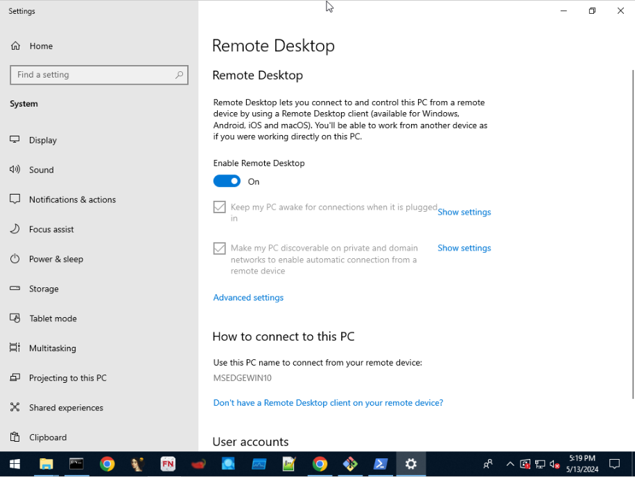

2. Descargamos Remmina y ponemos la IP de Windows para que se conecte por RPD (tenemos que estar conectados a la VPN).

    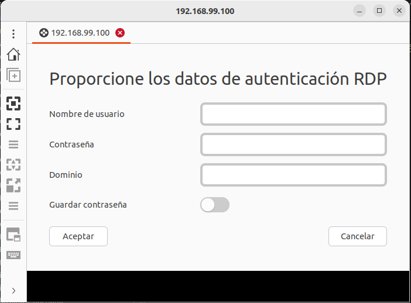

3. Por último iniciamos sesión con las credenciales de nuestro Windows.

    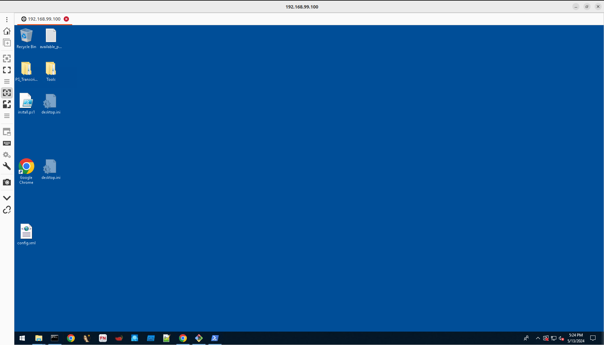

## Instalación Ubuntu Server + ELK

Partimos de tener instalado Ubuntu Server 22.04.

Nos aseguramos de tener IP estática, fichero /etc/netplan/00-installer-config.yaml

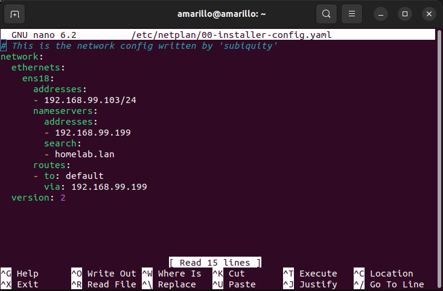

Ahora aplicamos los cambios: 

> netplan apply

Instalamos la pila ELK:

```bash
#!/bin/bash

wget -qO - https://artifacts.elastic.co/GPG-KEY-elasticsearch | sudo gpg --dearmor -o /usr/share/keyrings/elasticsearch-keyring.gpg

sudo apt-get install apt-transport-https

echo "deb [signed-by=/usr/share/keyrings/elasticsearch-keyring.gpg] https://artifacts.elastic.co/packages/8.x/apt stable main" | sudo tee /etc/apt/sources.list.d/elastic-8.x.list


sudo apt-get update
sudo apt-get install elasticsearch 
sudo apt-get install kibana
sudo apt-get install logstash

sudo /bin/systemctl daemon-reload
sudo /bin/systemctl enable elasticsearch.service
sudo /bin/systemctl enable kibana.service

sudo systemctl start elasticsearch.service
sudo systemctl start kibana.service
```
Ahora ya podemos ver elastic en el puerto 9200 y kibana en el 5601. 

El usuario será **elastic** y la contraseña la que se generó.

**Para resetear la contraseña del superusuario elastic hacemos:**

```bash
sudo /usr/share/elasticsearch/bin/elasticsearch-reset-password -a -u elastic
```

Cuando ejecutamos el comando debe salir algo así:


Para conectar vía túnel SSH:

```bash
ssh -L 5601:localhost:5601  amarillo@192.168.99.103
```

Ahora abrimos en un navegador la URL <http://localhost:5601>.

Para **generar un token para hacer el enrolment de kibana a elastic**:

```bash
sudo /usr/share/elasticsearch/bin/elasticsearch-create-enrollment-token -s kibana
```

Para obtener el código por el que me pregunta kibana:

```bash
sudo /usr/share/kibana/bin/kibana-verification-code
```

Ahora ya podemos hacer login con el usuario **elastic** y la contraseña que generamos anteriormente.

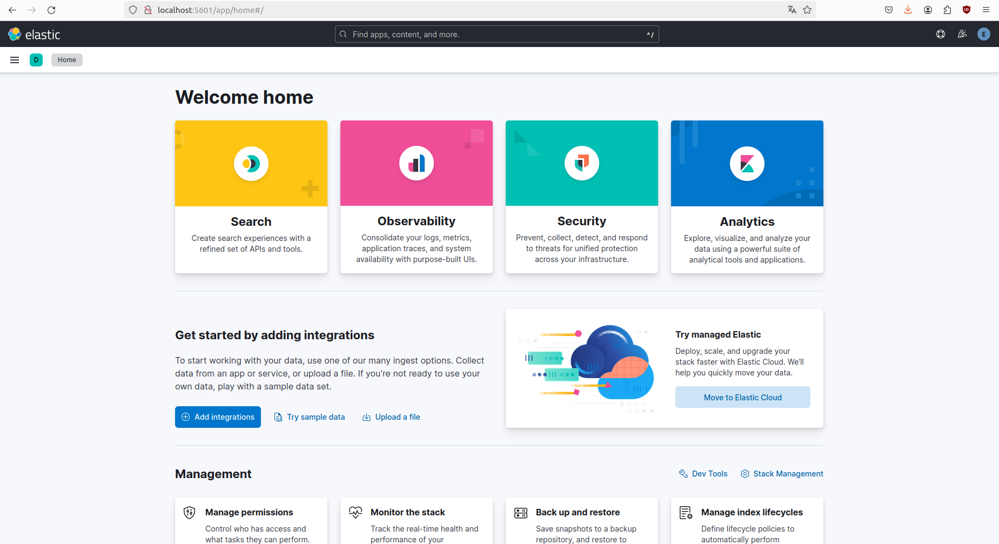

Una vez dentro de Kibana, vamos a añadir una primera integración, por ejemplo Sysmon para Linux. Buscamos "add integrations" > "Sysmon for Linux" > "Add Sysmon for Linux".

Una vez añadamos Sysmon a Elastic nos pide instalarnos el agente. Nos muestra una guía de como configurarlo:


Para añadir el servicio a la máquina primero nos descargamos el servicio con:

```bash
curl -L -O https://artifacts.elastic.co/downloads/beats/elastic-agent/elastic-agent-8.13.1-linux-x86_64.tar.gz
tar xzvf elastic-agent-8.13.1-linux-x86_64.tar.gz
cd elastic-agent-8.13.1-linux-x86_64
```
En la carpeta **/opt/Elastic/Agent** encontramos el archivo: **elastic-agent.yml**. Lo editamos y copiamos el contenido que nos dice Kibana en él (copiamos todo el contenido pulsando "Copy to clipboard").

También tenemos que cambiar el usuario y la contraseña a la que tengamos en elastic

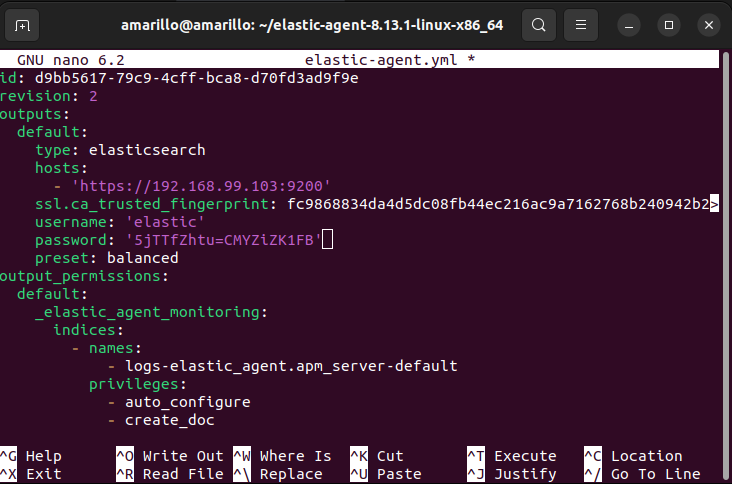

Para comprobar que ya funcione nos vamos a "Dashboards" y buscamos el dashboard de logs.

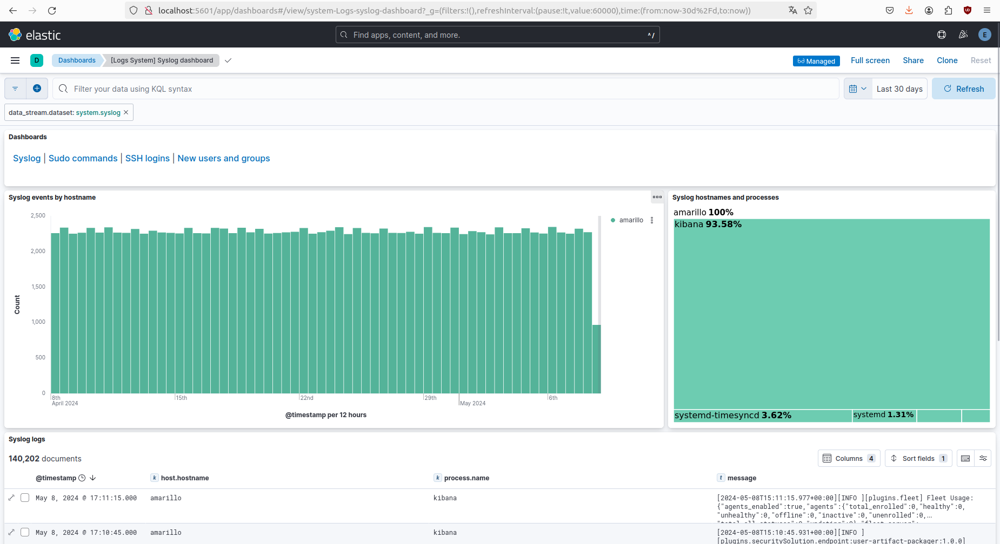

## Instalacion de Telegraph

Para instalarlo, nos vamos a nuestro pfsense, avalialiable packages y lo instalamos.

Esto será configurado por ssh ya que desde la interfaz no deja.

Para ello necesitamos activar la shell segura.

Una vez nos conectamos por ssh, elegimos la opcion 8 y nos a la carpeta /usr/local/etc donde tenedremos el archivo telegraph.conf y lo dejamos asi:

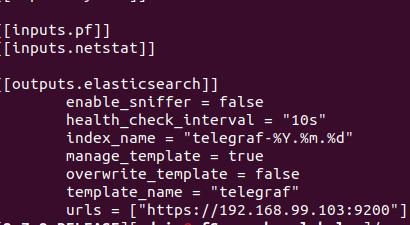

Esto es para enviar los datos al elastic.

Es probable que tengamos un error de certificado, para solucionarlo, nos vamos a nuestro pfsense y generamos un certificado para nuestro elastic.
Este certificado lo generamos importando una autoridad certificadora existente.
En los datos del certificado, copiamos la info que obtenemos al conectarnos a Elastic mediante https y copiamos el certificado.
Descargamos el "PEM (cert)" y copiamos desde el begin certificate hasta el end certificate. Con esto, en el pfsense, ya reconocemos esa identidad certificadora.

Para lanzar el telegraf, desde el pfsense en /usr/local/etc, lanzamos 'rc.d/telegraph.sh start'.

Si todo lo hemos hecho correctamente, tendriamos un index de telegraph en nuestro elastic.

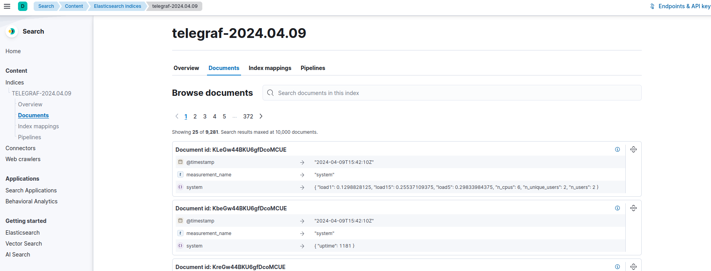

## Instalacion de FIR mediante contenedores

Vamos a hacerlo mediente un contenedor proxmox con ubuntu 20.04.

Vamos a necesitar un contenedor para MYSQL, otro para REDIS y otro para Django.

## Contenedor MYSQL
Como plantilla usamos la turnkey de debian 11 de Mysql.
Para la máquina de MYSQL asignamos 15 GB, 2 cores y 4GB de RAM y Swap.
Nos conectamos al Bridge 2 para conectarnos a nuestra LAN y le ponemos una IP estatica y como getaway el pfsense.

Como DNS ponemos el mismo que el gateway ya que es el pfsense.

Con esto ya tendriamos creado nuestro contenedor mysql

## Contenedor Redis
Como plantilla usamos la turnkey de debian 11 de Redis.
1 core, 8GB de disco, 1 GB de RAM y SWAP.
Nos conectamos al Bridge 2 para conectarnos a nuestra LAN y le ponemos una IP estatica y como getaway el pfsense.

## Contenedor Django
Como plantilla usamos la turnkey de debian 11 de Django.
2 core, 8GB de disco, 4 GB de RAM y SWAP.

Nos conectamos al Bridge 2 para conectarnos a nuestra LAN y le ponemos una IP estatica y como getaway el pfsense.

## Iniciando los contenedores

1) Empezamos arrancando el mysql, ya que necesitamos una base de datos antes de empezar.
2) Setemaos la contraseña de mysql.
3) Los siguientes pasos de la instalacion inicial de Mysql dependeran de tu eleccion.
4) Arrancamos el Redis y seguimos los pasos que nos indica. Pero señalamos que la interfaz va a responder a todos.
5) Arrancamos el django y seguimos los mismos pasos.
Importante, a la hora del dominio, indicamos cual queremos usar, en nuestro caso sera fir.homelab.lan.
6) Finalmente, nos metemos en el contenedor de Django y clonar el repositorio de FIR.

 ## Instalacion de FIR

Ahora en el contenedor de Django, instalamos las dependencias:
```bash
sudo apt-get update
sudo apt-get install python-dev python-pip python-lxml git libxml2-dev libxslt1-dev libz-dev
sudo pip install virtualenv
```

Creamos un entorno virtual de python y lo activamos
```bash
virtualenv env-FIR
source env-FIR/bin/activate           # Switch to virtualenv
```

Hacemos un fork del repositorio de Github y lo clonamos
```bash
git clone https://github.com/<yourhandlehere>/FIR.git
```

Accedemos al directorio e instalamos las dependencias Python:
```bash
pip install -r requirements.txt       # Install dependencies
```

Para habilitar los Plugins, copiamos fir/config/installed_apps.txt.sample a fir/config/installed_apps.txt
```bash
cp fir/config/installed_apps.txt.sample fir/config/installed_apps.txt
```

Creamos las tablas en la base de datos:
```bash
./manage.py migrate
```

Importamos los datos iniciales y los usuarios test
```bash
./manage.py loaddata incidents/fixtures/seed_data.json
./manage.py loaddata incidents/fixtures/dev_users.json
```

Cambiamos la zona horaria en el archivo base.py, ya que por defecto es EUrope/Paris.

Arrancamos el servidor
```bash
./manage.py runserver
```

Tras eso, editamos el fichero  /etc/ssh/sshd_config.d/turnkey.conf y cambiamos el 'AllowTcpForwarding yes'

Reiniciamos el servicio con 'systemctl restart sshd'

Abrimos un tunel 'ssh -L 8000:localhost:8000 root@192.168.99.23'.

Y ya podriamos acceder a traves del navegador http://localhost:8000 con admin/admin

Si todo va como deberia, ya podemos acceder.

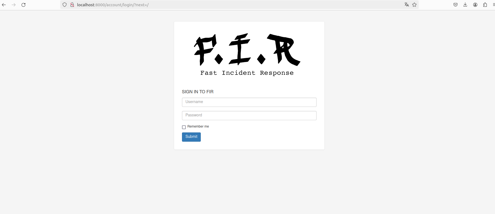